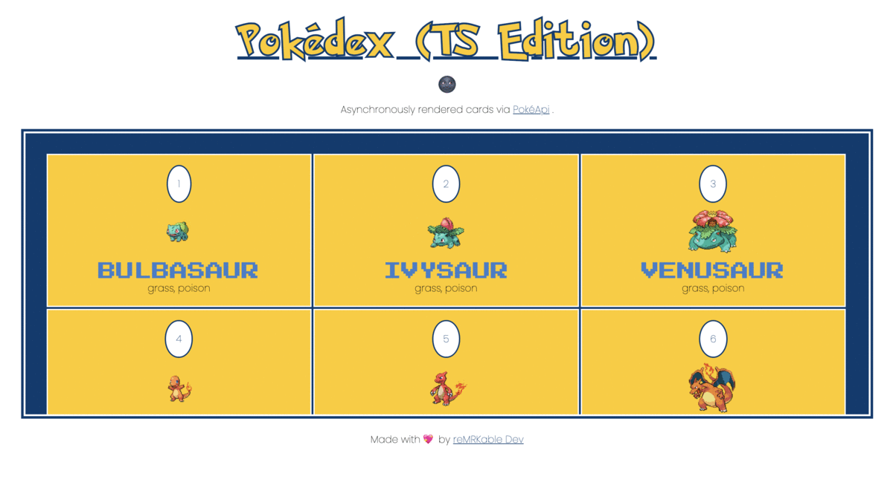

# Pokédex (TypeScript Edition) 🚀🚀🚀

A simple Pokédex built with TypeScript. Makes use of the PokéApi to call in data asynchronously.
This main purpose of this project is to learn how to use TypeScript on the DOM.

Colors used are found 👉 [here](assets/pokemon-colors.png) 👈



## Getting Started 🏁

These instructions will get you a copy of the project up and running on your local machine for development and testing purposes.

### Prerequisites

What things you need installed on your local machine.

```
Text editor
TypeScript installed
Git
```

### How To:

To use the app:

```
1. Fork and/or Clone repo.
2. Launch the 'index.html' file in your local environment.
```

Have fun :)

## Authors 💻

- **Malcolm R. Kente** - _Initial work_ - [reMRKable Dev](https://remrkabledev.com/)

## Acknowledgments 🗣️

This project was made by following the guide of [Ibrahim Ndaw's repo](https://github.com/ibrahima92/pokedex-typescript)
